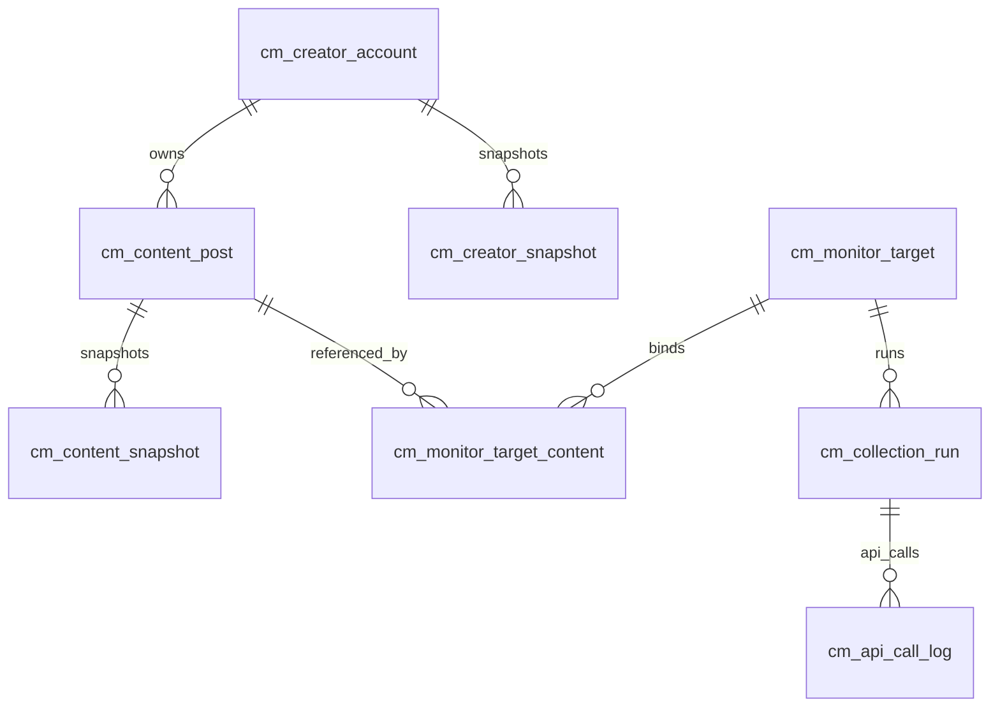

# 创作者监控一期数据库设计

> 版本：V1.0
> 日期：2026-06-10
> 范围：抖音作品监控一期，预留小红书字段
> SQL：`sql/creator_monitor_schema.sql`

## 1. 设计目标

本阶段数据库优先解决三个问题：

1. 作者主页监控和单作品监控必须分开，不能再把“平台作者”和“谁在监控”混成一条记录。
2. 作品是系统核心实体，同一个平台作品只保存一份，但可以被不同任务、不同员工或不同监控目标引用。
3. 每 30 分钟刷新作品指标时，要能保留历史快照，计算点赞、评论、收藏、分享的增长量。

## 2. 核心规则

### 2.1 作者监控

正式员工添加作者后，系统创建一个 `creator_collection` 类型的监控目标。

规则：

- 添加作者时采集作者主页信息。
- 记录 `baseline_time`。
- 后续只自动发现 `baseline_time` 之后发布的新作品。
- 不导入作者历史作品。
- 作者主页数据默认每 6 小时刷新一次。
- 作品指标默认每 30 分钟刷新一次。

### 2.2 单作品监控

员工或兼职通过作品链接添加作品后，系统创建一个 `single_content` 类型的监控目标。

规则：

- 只识别并监控这个作品。
- 不自动扩展到该作者的其他作品。
- 可以识别作者信息并绑定作者基础资料，但不会开启作者作品集扫描。
- 作品指标默认每 30 分钟刷新一次。

### 2.3 平台实体和业务关系分离

平台实体：

```text
cm_creator_account
cm_content_post
```

业务监控关系：

```text
cm_monitor_target
cm_monitor_target_content
```

这样同一个作品可以被多个业务场景引用，例如正式员工添加、兼职任务提交、运营手动跟踪，但平台作品本身只保存一份。

## 3. 表清单

| 表名 | 作用 |
| --- | --- |
| `cm_creator_account` | 平台作者基础信息和最新主页指标 |
| `cm_content_post` | 平台作品基础信息和最新互动指标 |
| `cm_monitor_target` | 谁在监控什么，区分作者监控和单作品监控 |
| `cm_monitor_target_content` | 监控目标和作品的绑定关系 |
| `cm_creator_snapshot` | 作者主页指标历史快照 |
| `cm_content_snapshot` | 作品互动指标历史快照 |
| `cm_collection_run` | 每次采集任务的运行记录 |
| `cm_api_call_log` | 每次 TikHub 调用的成本和结果记录 |

## 4. 表关系



## 5. 关键字段说明

### 5.1 `cm_creator_account`

保存平台作者唯一资料。

关键字段：

| 字段 | 说明 |
| --- | --- |
| `platform` | 平台，第一期为 `douyin` |
| `platform_creator_id` | 平台作者稳定 ID，抖音优先使用 `sec_user_id` |
| `platform_user_id` | 平台数字 uid，有就保存 |
| `platform_display_id` | 用户看到的抖音号 |
| `follower_count` | 最新粉丝数 |
| `total_favorited_count` | 最新累计获赞 |
| `content_count` | 最新作品数 |
| `profile_status` | 作者主页数据状态 |
| `raw_profile_json` | 最近一次原始响应，便于字段追踪 |

唯一约束：

```text
tenant_id + platform + platform_creator_id
```

### 5.2 `cm_content_post`

保存平台作品唯一资料和最新指标。

关键字段：

| 字段 | 说明 |
| --- | --- |
| `platform_content_id` | 平台作品稳定 ID，抖音为 `aweme_id` |
| `creator_id` | 作品作者 |
| `publish_time` | 平台发布时间 |
| `first_seen_at` | 系统第一次发现时间 |
| `added_source` | 来源：链接添加、作者发现、任务提交 |
| `latest_like_count` | 最新点赞数 |
| `latest_comment_count` | 最新评论数 |
| `latest_collect_count` | 最新收藏数 |
| `latest_share_count` | 最新分享数 |
| `metrics_status` | 指标状态：完整、部分、失败等 |

唯一约束：

```text
tenant_id + platform + platform_content_id
```

### 5.3 `cm_monitor_target`

这是业务层最重要的表，表示“谁在监控什么”。

`target_type` 有两种：

```text
creator_collection  作者作品集监控
single_content      单作品监控
```

作者监控时：

```text
creator_id 有值
content_id 为空
discover_new_content = 1
baseline_time = 添加作者时的时间
```

单作品监控时：

```text
content_id 有值
creator_id 可有可无
discover_new_content = 0
baseline_time 可为空
```

权限字段：

```text
owner_user_id
owner_dept_id
direct_superior_user_id
create_by
create_dept
```

后续查询本人和下级数据时，可以结合若依 `sys_dept`、`sys_user` 和这些字段做数据范围控制。

### 5.4 `cm_monitor_target_content`

用于记录某个监控目标包含哪些作品。

为什么需要这张表：

- 作者监控目标会随着新作品不断增加作品。
- 单作品监控目标永远只绑定一个作品。
- 同一个作品可能被多个业务目标引用。

唯一约束：

```text
tenant_id + target_id + content_id
```

### 5.5 `cm_content_snapshot`

每次作品指标采集成功后写入一条快照。

字段包含：

```text
like_count
comment_count
collect_count
share_count
like_delta
comment_delta
collect_delta
share_delta
metrics_status
missing_metric_fields
```

如果 TikHub 某次返回缺少收藏数或分享数，`metrics_status` 可以记为 `partial`，并把缺失字段写入 `missing_metric_fields`。

### 5.6 `cm_collection_run`

记录一次采集过程，例如：

```text
识别作品
采集作品指标
扫描作者新作品
采集作者主页
```

它用于排查：

- 哪次任务失败了
- 失败原因是什么
- 调用了多少次 TikHub
- 估算花了多少钱
- 发现了多少新作品

### 5.7 `cm_api_call_log`

记录每一次外部接口调用。

用于回答你之前非常关心的问题：

```text
今天的钱花到哪里了？
哪个接口最贵？
哪个接口调用最多？
哪些接口失败率最高？
```

## 6. 状态枚举建议

### 6.1 平台

```text
douyin
xiaohongshu
```

### 6.2 监控目标类型

```text
creator_collection
single_content
```

### 6.3 监控状态

```text
active
paused
stopped
failed
```

### 6.4 数据状态

```text
pending
full
partial
no_new_content
failed
budget_limited
```

### 6.5 采集运行状态

```text
running
success
partial
failed
skipped
budget_limited
```

## 7. 典型流程

### 7.1 添加作者监控

```text
1. 输入作者主页链接或抖音号
2. TikHub 识别作者 ID
3. 写入或更新 cm_creator_account
4. 写入 cm_creator_snapshot
5. 创建 cm_monitor_target，target_type=creator_collection
6. baseline_time=当前时间
7. 不导入历史作品
8. 后续定时扫描新作品
```

### 7.2 作者发布新作品后自动加入

```text
1. SnailJob 触发新作品扫描
2. 查询 active 的 creator_collection 目标
3. 调用 TikHub 作者作品列表接口
4. 只保留 publish_time > baseline_time 的作品
5. 写入 cm_content_post
6. 写入 cm_monitor_target_content
7. 新作品进入 30 分钟指标采集队列
```

### 7.3 添加单个作品链接

```text
1. 输入作品链接或分享文案
2. 提取纯链接
3. TikHub 识别作品详情
4. 写入或更新 cm_creator_account
5. 写入或更新 cm_content_post
6. 创建 cm_monitor_target，target_type=single_content
7. 写入 cm_monitor_target_content
8. 后续只刷新这个作品的指标
```

### 7.4 刷新作品指标

```text
1. SnailJob 查询到期的 active 监控目标
2. 汇总需要刷新指标的 content_id
3. 调用 TikHub 单个或批量统计接口
4. 更新 cm_content_post 最新指标
5. 对比上一条 cm_content_snapshot 计算增长量
6. 写入新的 cm_content_snapshot
7. 写入 cm_collection_run 和 cm_api_call_log
```

## 8. 索引策略

第一期重点优化以下查询：

1. 按当前用户/部门查看有权限的监控目标。
2. 内容动态按发布时间或最新采集时间倒序。
3. 作品详情页查询最近快照趋势。
4. 定时任务扫描下一批到期目标。
5. 统计 TikHub 每日调用次数和费用。

对应索引已写入 SQL：

```text
idx_cm_target_owner
idx_cm_target_schedule
idx_cm_content_creator_publish
idx_cm_content_snapshot_time
idx_cm_api_time
idx_cm_api_endpoint
```

## 9. 暂不纳入本 SQL 的表

以下功能很重要，但建议下一步单独设计：

```text
兼职任务表
任务领取表
任务提交表
佣金台账表
结算记录表
素材库表
AI 文案表
用户业务扩展表
```

原因是当前阶段应先把作品监控闭环做稳。任务、佣金、小程序可以引用本设计中的 `cm_content_post` 和 `cm_monitor_target`。

## 10. 实施建议

建议下一步顺序：

1. 执行 `sql/creator_monitor_schema.sql` 创建业务表。
2. 在后端新增业务模块，例如 `ruoyi-modules/ruoyi-creator`。
3. 先生成作者、作品、监控目标、快照、采集记录的实体和 Mapper。
4. 先做单作品链接添加闭环。
5. 再做作者新增作品自动发现。
6. 最后接入 SnailJob 定时刷新和 TikHub 成本记录。
