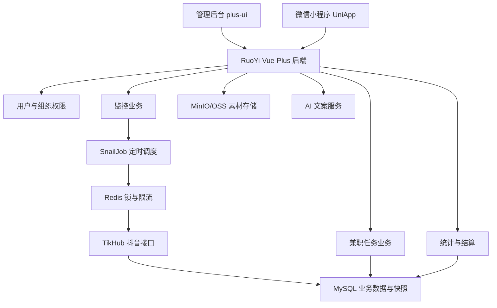
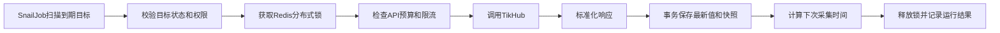

# 创作者作品监测与兼职任务管理平台产品需求文档（PRD）

> 文档版本：V1.0  
> 编写日期：2026-06-09  
> 重构目标：Java + RuoYi-Vue-Plus  
> 一期平台：抖音  
> 后续平台：小红书  
> 数据服务：TikHub

---

## 1. 文档说明

### 1.1 项目名称

创作者作品监测与兼职任务管理平台。

### 1.2 文档目的

本文档用于指导现有创作者监控系统向 Java + RuoYi-Vue-Plus 架构重构，并将以下两类业务整合为一套系统：

1. 公司正式员工账号及作品集持续监控。
2. 兼职人员领取任务、发布作品、提交链接、审核结算和单作品持续监控。

本文档是产品设计、UI设计、数据库设计、后端开发、前端开发、小程序开发、测试和验收的共同依据。

### 1.3 项目背景

当前系统已经具备抖音账号信息识别、单作品添加、作品指标采集、内容动态展示、历史快照和定时任务等基础能力，但仍存在以下问题：

- 系统用户、部门和上下级数据权限不完整。
- 正式员工账号监控和兼职单作品监控的业务边界不够清晰。
- 平台作者、平台作品与“谁在监控”之间耦合，容易出现重复作者或监控范围混乱。
- 缺少任务领取、作品提交、审核、佣金和结算闭环。
- 缺少微信小程序端。
- 采集调度、失败重试、批量操作和API成本控制需要进一步标准化。
- 现有 Python + FastAPI 项目将逐步由 Java + RuoYi-Vue-Plus 重构。

### 1.4 产品目标

一期产品需要完成以下业务闭环：

```text
后台创建组织和用户
→ 正式员工添加作者或单个作品
→ 兼职人员通过小程序领取任务
→ 兼职人员发布作品并提交链接
→ 系统识别作者和作品
→ 系统定时采集作品互动指标
→ 系统计算每30分钟增长量
→ 上级查看本人及全部下级数据
→ 运营审核兼职提交
→ 系统生成佣金记录
→ 财务或管理员人工确认结算
```

### 1.5 核心产品原则

1. 系统以“作品监控”为核心，作者监控用于发现正式员工后续发布的新作品。
2. 作者主页监控和单作品监控必须是两种明确、互不混淆的监控模式。
3. 同一个抖音作者和同一个抖音作品在平台基础数据层只保存一份。
4. “平台数据实体”和“业务监控关系”分离，允许同一作品被不同任务或不同人员引用。
5. 作品链接添加后永远只监控该作品，不自动扩展作者的其他作品。
6. 正式员工作者添加后，只自动发现添加时间之后发布的新作品，不导入历史作品。
7. 页面“刷新”与调用TikHub“立即采集”必须明确区分。
8. 所有外部API调用必须可统计、可限流、可重试、可审计、可控制成本。

---

## 2. 产品范围

### 2.1 一期范围

一期优先完成抖音业务闭环，包括：

- 若依系统用户、角色、部门、岗位和菜单权限。
- 用户上下级关系和数据权限。
- 正式员工与兼职人员身份管理。
- 抖音作者识别、作者主页数据采集。
- 抖音单作品链接识别和监控。
- 正式员工作者新增作品自动发现。
- 作品点赞、评论、收藏、分享数据监控。
- 作品历史快照和指标增长量。
- 单条立即采集和有权限的批量采集。
- 采集运行记录、失败重试和异常预警。
- 微信小程序授权登录和手机号绑定。
- 兼职任务发布、领取、作品提交和审核。
- 基础任务单价、佣金台账和人工结算。
- 基础素材库。
- 基础AI文案生成和文案模板管理。
- 兼职人员专属二维码和基础邀请归属。
- 数据查询、筛选和Excel导出。

### 2.2 二期范围

- 小红书账号与笔记监控模块。
- 评论正文采集、关键词和情绪分析。
- 高级AI文案、多版本生成和效果学习。
- 素材智能推荐和自动匹配。
- 二级审核、申诉和复杂风控。
- 提现申请、财务审批和微信自动打款。
- 阶梯佣金、奖励、罚款和补贴。
- 二维码渠道统计和多级推广归因。
- 导流、咨询、成交和客户转化管理。
- 高级数据看板、日报、周报和绩效分析。
- 多租户或对外SaaS能力。

### 2.3 暂不纳入范围

- 抖音作品播放量、完播率和流量来源等非公开后台指标。
- 绕过登录、验证码或平台安全机制的数据采集。
- 自动发布抖音作品。
- 自动操作用户抖音账号。
- 一期自动向兼职人员银行卡或微信账户付款。
- 一期微服务拆分。

---

## 3. 名词定义

| 名词 | 定义 |
| --- | --- |
| 平台作者 | 抖音或小红书平台中的创作者实体，同一平台账号只保存一份 |
| 平台作品 | 平台中唯一的公开作品，同一作品只保存一份 |
| 作者监控 | 对指定作者建立监控基线，持续发现基线时间之后的新作品 |
| 单作品监控 | 通过作品链接添加，只持续监控该作品 |
| 监控目标 | 某个用户或部门对作者/作品建立的业务监控关系 |
| 基线时间 | 作者监控正式生效时间，新作品发布时间必须晚于该时间 |
| 内容动态 | 当前有权查看的被监控作品列表及最新指标 |
| 指标快照 | 某次采集得到的点赞、评论、收藏、分享数据 |
| 增长量 | 当前快照与上一快照之间的指标差值 |
| 任务 | 运营人员发布给兼职人员的代发要求 |
| 任务提交 | 兼职人员提交作品链接形成的完成记录 |
| 佣金台账 | 审核通过后生成的应付金额记录 |
| 数据所有人 | 负责某个监控目标、任务或作品业务关系的系统用户 |
| 数据所属部门 | 数据所有人所属的组织部门 |

---

## 4. 用户体系与组织关系

### 4.1 系统用户来源

系统用户统一使用若依用户体系 `sys_user`，不另外建设一套独立后台账号。

微信小程序兼职用户首次登录后，在系统中创建或绑定一个若依用户，并附加兼职业务资料。

### 4.2 人员类型与系统角色分离

人员类型决定业务规则：

```text
formal       正式员工
part_time    兼职人员
external     外部合作人员（预留）
```

系统角色决定功能权限：

```text
super_admin          超级管理员
admin                管理员
department_manager   部门负责人
operator             运营人员
formal_staff         正式员工
part_time_staff      兼职人员
finance              财务人员
auditor              审核人员
```

同一个用户可以拥有多个角色，但只能有一个主要人员类型。

### 4.3 上下级关系

一期采用以下规则：

- 一个兼职人员只能属于一个部门。
- 一个兼职人员只有一个直接上级。
- 一个正式员工原则上也只有一个直接上级。
- 部门通过若依 `sys_dept` 形成树形组织。
- 用户直属上级通过业务扩展字段 `direct_superior_user_id` 保存。
- 邀请人和直属上级分别保存，不得混用。

推荐扩展字段：

```text
employment_type          人员类型
direct_superior_user_id  直属上级用户ID
inviter_user_id          邀请人用户ID
wechat_openid            小程序openid
wechat_unionid           微信unionid
mobile_verified          手机号是否验证
onboarding_status        入驻状态
```

### 4.4 微信小程序登录

一期采用“微信授权登录 + 首次绑定手机号”：

1. 用户通过微信进入小程序。
2. 小程序调用微信登录获得临时登录凭证。
3. 后端换取 `openid`，识别或创建用户。
4. 首次登录要求授权绑定手机号。
5. 用户填写必要的兼职资料。
6. 后续通过微信身份自动登录。

一期不单独建设短信验证码登录，后续可作为备用登录方式。

### 4.5 数据可见范围

| 用户类型 | 默认数据范围 |
| --- | --- |
| 超级管理员 | 全部数据 |
| 管理员 | 全部业务数据，按权限控制管理操作 |
| 部门负责人 | 本人、本部门及全部下级部门数据 |
| 直属上级 | 本人及全部递归下级人员数据 |
| 正式员工 | 本人负责的作者、作品、任务和数据 |
| 兼职人员 | 本人领取的任务、本人提交的作品、本人佣金 |
| 审核人员 | 分配给本人或授权部门范围内的待审核数据 |
| 财务人员 | 授权范围内的待结算和已结算数据 |

### 4.6 数据权限实现原则

所有业务数据至少保存：

```text
owner_user_id    数据所有人
owner_dept_id    数据所属部门
created_by       创建人
created_time     创建时间
updated_by       最后修改人
updated_time     最后修改时间
```

查询时同时校验：

1. 用户是否拥有功能权限。
2. 用户是否拥有目标资源的数据范围。
3. 用户是否是资源所有人、上级、部门负责人或管理员。

禁止仅依赖前端隐藏按钮实现权限。

---

## 5. 角色权限矩阵

| 功能 | 管理员 | 部门负责人/上级 | 正式员工 | 兼职人员 | 审核人员 | 财务 |
| --- | --- | --- | --- | --- | --- | --- |
| 查看全部数据 | 是 | 否 | 否 | 否 | 否 | 否 |
| 查看本人及下级数据 | 是 | 是 | 视角色 | 否 | 按授权 | 按授权 |
| 添加作者监控 | 是 | 是 | 是 | 否 | 否 | 否 |
| 添加单作品监控 | 是 | 是 | 是 | 仅添加本人作品 | 否 | 否 |
| 修改采集频率 | 是 | 按授权 | 否 | 否 | 否 | 否 |
| 单条立即采集 | 是 | 是 | 是 | 否 | 按授权 | 否 |
| 批量立即采集 | 是 | 按权限 | 否 | 否 | 否 | 否 |
| 删除监控目标 | 是 | 按数据范围 | 本人创建 | 否 | 否 | 否 |
| 发布任务 | 是 | 是 | 按权限 | 否 | 否 | 否 |
| 领取任务 | 否 | 否 | 可配置 | 是 | 否 | 否 |
| 提交作品链接 | 是 | 是 | 是 | 是 | 否 | 否 |
| 审核任务提交 | 是 | 按权限 | 否 | 否 | 是 | 否 |
| 调整佣金 | 是 | 按权限 | 否 | 否 | 按权限 | 按权限 |
| 确认结算 | 是 | 否 | 否 | 否 | 否 | 是 |
| 导出数据 | 是 | 按权限 | 按权限 | 否 | 按权限 | 按权限 |

建议权限标识：

```text
monitor:creator:list
monitor:creator:add
monitor:creator:edit
monitor:creator:remove
monitor:creator:collect

monitor:content:list
monitor:content:add
monitor:content:collect
monitor:content:batchCollect
monitor:content:export

task:manage:list
task:manage:add
task:manage:publish
task:claim
task:submit
task:audit

commission:ledger:list
commission:ledger:adjust
commission:settlement:confirm
```

---

## 6. 总体业务架构



### 6.1 业务模块划分

```text
system       若依用户、角色、部门、菜单、字典、日志
monitor      平台作者、作品、监控目标、指标快照
collector    TikHub客户端、采集任务、调用记录、预算控制
task         任务发布、领取、提交、审核
commission   佣金台账、结算批次
material     图片、视频、分类和任务素材
ai           文案模板、文案生成记录
miniapp      微信登录、兼职入驻、个人中心、二维码
report       看板、筛选、导出和统计
alert        新作品、采集失败、作品异常和系统通知
```

---

## 7. 核心数据结构原则

### 7.1 平台实体与监控关系分离

系统不直接将一个平台作者永久绑定给某一个业务用户，而是分为：

```text
平台作者 creator_account
平台作品 content_post
监控目标 monitor_target
```

示例：

```text
抖音作者A只保存一份
正式员工张三建立“作者监控”
运营李四通过链接建立“单作品监控”
兼职王五通过任务提交同一作品
```

上述业务可以引用同一个作者和作品实体，但分别保存自己的监控关系、所有人、任务和权限。

### 7.2 监控目标类型

```text
creator_collection   作者作品集监控
single_content       单作品监控
```

`creator_collection`：

- 必须关联平台作者。
- 保存基线时间。
- 定时检查基线后新作品。
- 自动将新作品加入该监控目标。

`single_content`：

- 必须关联一个平台作品。
- 可以关联平台作者，但不扩展监控作者其他作品。
- 永久只刷新指定作品。

### 7.3 重复添加规则

- 同平台、同 `platform_creator_id` 只创建一个平台作者。
- 同平台、同 `platform_content_id` 只创建一个平台作品。
- 同一用户对同一作者建立相同类型监控时，提示已存在。
- 同一用户对同一作品重复建立单作品监控时，提示已存在。
- 不同用户可以根据业务权限引用同一作品，但不得重复调用外部API保存多份基础数据。
- 同一任务提交同一作品链接时禁止重复提交。
- 一个作品是否允许被不同兼职人员重复提交，由任务配置决定，默认不允许。

---

## 8. 抖音作者监控需求

### 8.1 添加作者入口

支持：

- 粘贴抖音作者主页链接。
- 粘贴包含链接的分享文案，系统自动提取纯链接。
- 输入抖音号，并通过TikHub识别。
- 管理后台手动补充备注和标签。

不要求用户填写 `sec_user_id`。系统识别后可以在详情中展示技术标识，但不作为普通用户主要操作字段。

### 8.2 作者识别结果

系统展示并保存：

- 作者昵称。
- 抖音号。
- 平台作者唯一ID。
- `sec_user_id`。
- 头像。
- 简介。
- 粉丝数，精确到个。
- 关注数，精确到个。
- 累计获赞数，精确到个。
- 公开作品数，精确到个。
- 认证信息。
- IP属地或地区（接口可用时）。
- 作者主页链接。
- 识别时间和数据来源。
- 作者备注、标签、负责人。

### 8.3 正式员工作者监控

正式员工或有权限的后台用户添加作者后：

1. 系统识别并保存作者主页信息。
2. 系统记录 `baseline_at`。
3. 首次添加不导入作者历史作品。
4. 系统按新作品扫描频率检查作者最近作品。
5. 仅将发布时间晚于 `baseline_at` 的作品加入监控。
6. 新作品加入后按作品监控频率刷新指标。

### 8.4 兼职人员限制

兼职人员不能在小程序中直接建立作者作品集监控，只能：

- 领取任务。
- 提交自己发布的作品链接。
- 在“我的作品”中单独添加本人作品链接。
- 查看自己的作品数据和佣金状态。

管理员可以根据实际情况将兼职人员升级为拥有作者监控权限的角色，但这不是默认规则。

### 8.5 作者主页刷新

默认每6小时刷新一次：

- 粉丝数。
- 关注数。
- 累计获赞。
- 公开作品数。
- 昵称、头像、简介等可能变化的信息。

作者主页刷新频率可由管理员调整，建议选项：

```text
每1小时
每3小时
每6小时（默认）
每12小时
每天
暂停
```

作者主页刷新不等于作品指标刷新，也不应在每次作品采集时重复调用。

### 8.6 新作品扫描

默认每30分钟扫描一次作者最近作品，频率可配置：

```text
每15分钟
每30分钟（默认）
每1小时
每3小时
每6小时
暂停
```

新作品扫描只负责：

- 获取作者最近作品列表。
- 与系统现有作品ID比较。
- 识别基线时间之后的新作品。
- 新作品入库并创建监控关系。

没有新作品时不得调用昂贵的作品批量详情接口。

---

## 9. 单作品监控需求

### 9.1 添加入口

后台内容动态页提供“添加作品链接”按钮，小程序任务提交页也支持作品链接提交。

小程序“我的作品”提供独立添加入口。兼职人员不关联任务添加作品时，只建立本人单作品监控，不产生任务领取、审核和佣金记录。

支持输入：

- 抖音短链接。
- 抖音完整作品链接。
- 包含链接的抖音分享文案。

系统自动提取分享文案中的第一个合法抖音作品链接。

### 9.2 识别结果

识别后展示：

- 作者昵称和头像。
- 抖音号或平台作者标识。
- 作品标题或文案。
- 封面。
- 作品类型。
- 发布时间。
- 点赞数。
- 评论数。
- 收藏数。
- 分享数。
- 作品公开链接。
- 是否已存在于系统。

### 9.3 添加规则

用户确认后：

1. 保存或复用平台作者。
2. 保存或复用平台作品。
3. 创建 `single_content` 监控目标。
4. 保存数据所有人和所属部门。
5. 创建第一次指标快照。
6. 设置下一次采集时间。

无论系统是否已经存在该作者，作品链接添加都不得自动转为作者作品集监控。

### 9.4 监控范围

作品链接添加后：

- 永远只监控该作品。
- 不扫描作者主页作品列表。
- 不自动加入作者后续作品。
- 不需要周期性刷新作者主页指标。
- 可以在作品详情中展示作者基础信息。

### 9.5 删除规则

- 删除监控目标默认只停止当前业务关系，不直接删除共享平台作品。
- 只有不存在任何监控目标、任务提交或历史引用时，管理员才能物理清理平台作品。
- 普通删除采用逻辑删除并保留审计记录。

---

## 10. 内容动态模块

### 10.1 页面目标

内容动态页用于展示当前用户权限范围内所有正在监控的作品，而不是简单展示数据库全部作品。

### 10.2 列表字段

- 作品封面或类型标识。
- 作者昵称。
- 平台。
- 发布时间。
- 作品标题或文案摘要。
- 数据来源。
- 监控模式：作者自动发现/链接单独添加/兼职任务提交。
- 负责人。
- 所属部门。
- 标签。
- 点赞数。
- 评论数。
- 收藏数。
- 分享数。
- 最近30分钟增长量。
- 最近采集时间。
- 下次采集时间。
- 数据状态。
- 监控状态。

### 10.3 默认排序

默认按作品实际发布时间倒序：

```text
published_at DESC
first_discovered_at DESC
id DESC
```

不得按创建记录时间代替作品发布时间。

### 10.4 筛选条件

- 平台。
- 监控模式。
- 作者。
- 作品标题或文案。
- 负责人。
- 部门。
- 标签。
- 任务。
- 发布时间范围。
- 最近采集时间。
- 数据状态。
- 监控状态。
- 点赞、评论、收藏、分享区间。

### 10.5 页面操作

- 查看作品详情。
- 打开抖音作品。
- 查看指标趋势。
- 立即采集。
- 暂停或恢复监控。
- 编辑负责人、备注和标签。
- 删除监控关系。
- 批量采集。
- 批量暂停或恢复。
- 按筛选条件导出。

### 10.6 “刷新页面”与“立即采集”

必须使用不同按钮和提示：

| 操作 | 行为 | 是否调用TikHub |
| --- | --- | --- |
| 刷新列表 | 重新从本系统数据库读取最新数据 | 否 |
| 立即采集 | 调用TikHub获取最新作品指标并生成快照 | 是 |
| 批量采集 | 对有权限的选中作品发起异步采集任务 | 是 |

前端不得使用“刷新动态”同时表达以上两种行为。

---

## 11. 作品指标采集与增长计算

### 11.1 采集指标

一期采集：

```text
点赞数 digg_count
评论数 comment_count
收藏数 collect_count
分享数 share_count
```

接口缺少某项指标时保存为 `NULL`，前端显示“暂不可用”，不得用0代替未知数据。

### 11.2 自动采集频率

作品默认每30分钟采集一次，管理员可以调整：

```text
每15分钟
每30分钟（默认）
每1小时
每3小时
每6小时
每天
暂停
```

批量修改采集频率需要独立权限。

### 11.3 手动采集

每条作品后提供“立即采集”按钮：

- 点击后创建异步采集任务。
- 前端立即提示任务已提交。
- 采集完成后自动更新当前作品。
- 同一作品已有任务执行时，不重复创建任务。
- 手动采集也必须经过Redis锁、限流、预算和重试机制。

### 11.4 批量采集

批量采集规则：

- 仅拥有 `monitor:content:batchCollect` 权限的用户可见。
- 只能操作当前数据权限范围内的作品。
- 支持勾选作品或对当前筛选结果执行。
- 必须设置单次最大数量，默认100条。
- 批量任务分片执行，避免同时请求外部API。
- 页面展示总数、成功数、失败数、跳过数和进行中数量。
- 批量采集必须二次确认并提示预计调用次数。

### 11.5 快照规则

每次成功采集生成一条作品指标快照，至少保存：

- 作品ID。
- 点赞数。
- 评论数。
- 收藏数。
- 分享数。
- 采集时间。
- 数据来源。
- API调用记录ID。
- 数据完整状态。

完全相同的指标是否保存新快照由系统参数控制，默认保存，以便证明监控任务按期执行。

### 11.6 增长量

系统计算：

```text
单次增长 = 当前快照 - 上一次快照
1小时增长
24小时增长
7天增长
累计增长 = 当前指标 - 首次监控指标
```

指标下降时允许显示负数，可能代表平台数据修正、内容状态变化或接口口径变化。

### 11.7 数据状态

统一状态：

```text
complete          四项核心指标完整
partial           至少一项核心指标缺失
unavailable       当前无法获取指标
budget_limited    因预算限制停止调用
rate_limited      外部接口限流
failed            采集失败
stale             超过预期时间未更新
```

前端必须显示具体缺失项，例如：

```text
指标部分缺失：收藏数不可用
指标部分缺失：收藏数、分享数不可用
```

不得只显示“真实部分可用”或“指标部分缺失”而不说明原因。

---

## 12. 采集调度与异常处理

### 12.1 调度框架

一期使用 RuoYi-Vue-Plus 集成的 SnailJob。

推荐任务：

| 任务 | 默认周期 | 说明 |
| --- | --- | --- |
| 到期作品扫描 | 每1分钟 | 找出 `next_collect_at <= now` 的作品 |
| 到期作者作品扫描 | 每1分钟 | 找出需要检查新作品的作者 |
| 到期作者主页扫描 | 每5分钟 | 找出需要刷新主页信息的作者 |
| API日成本汇总 | 每天 | 汇总TikHub调用量和费用 |
| 失败任务检查 | 每5分钟 | 对连续失败目标生成预警 |
| 过期任务处理 | 每10分钟 | 关闭过期兼职任务 |

### 12.2 标准执行流程



### 12.3 幂等与防重复

- 同一监控目标同一时间只能有一个采集任务。
- Redis锁必须设置合理过期时间。
- 数据库使用唯一约束防止重复作品和重复快照业务键。
- 外部调用成功、数据库写入失败时允许重试，重试不得重复创建作品。
- 用户重复点击立即采集时返回已有任务状态。

### 12.4 重试规则

可重试：

- 网络超时。
- TikHub 5xx。
- 临时限流。
- 临时网关错误。

不自动重试：

- Token无效。
- 参数错误。
- 作品链接无效。
- 作品不存在或已删除。
- 预算已用完。

默认最多重试3次，使用指数退避：

```text
第1次：30秒后
第2次：2分钟后
第3次：10分钟后
```

### 12.5 作品异常状态

```text
normal       正常公开
deleted      疑似删除
private      疑似转私密
restricted   访问受限
unknown      状态未知
```

一次失败不得立即判定删除。连续多次得到明确不存在结果后才更新状态，并保留原有历史指标。

---

## 13. TikHub接口与成本控制

### 13.1 接口用途

一期按TikHub实际文档和可用版本确定最终路径，业务用途包括：

| 用途 | 典型接口 |
| --- | --- |
| 根据作者信息获取主页数据 | `handler_user_profile` |
| 获取作者最近作品用于发现新作品 | `fetch_user_post_videos` |
| 根据分享链接识别单个作品 | `fetch_one_video_by_share_url` |
| 批量刷新作品统计指标 | `fetch_multi_video_statistics` |

### 13.2 调用原则

- 添加单作品时只调用单作品识别接口。
- 单作品监控不调用作者作品列表接口。
- 普通作品指标刷新优先使用支持批量的统计接口。
- 作者主页接口默认每6小时调用一次，不随每次作品采集调用。
- 作者最近作品接口只用于 `creator_collection` 新作品发现。
- API响应原文可脱敏保存用于排障，设置保留周期。

### 13.3 成本控制

系统提供：

- 每日预算上限。
- 单次批量采集上限。
- 每个接口调用次数统计。
- 按日期、用户、部门、任务和接口统计成本。
- 预算达到80%预警。
- 预算达到100%后停止自动调用。
- 管理员手动采集是否允许超预算由系统参数控制，默认不允许。

### 13.4 调用记录

每次API请求记录：

- 服务商。
- 接口名称。
- 请求业务类型。
- 关联作者或作品。
- 调用用户或系统任务。
- 请求开始和结束时间。
- 响应耗时。
- HTTP状态。
- 业务响应码。
- 是否成功。
- 重试次数。
- 估算或实际费用。
- 错误摘要。
- Trace ID。

Token、完整Authorization头和敏感参数不得写入日志。

---

## 14. 兼职人员小程序

### 14.1 首页

展示：

- 可领取任务。
- 进行中任务。
- 待审核提交。
- 待结算佣金。
- 已结算金额。
- 系统通知。

### 14.2 首次入驻

首次登录必须完成：

- 微信授权登录。
- 手机号绑定。
- 真实姓名。
- 微信号。
- 所属地区。
- 抖音号（可选，提交作品后可补充）。
- 邀请码或扫码归属。
- 隐私政策和用户协议确认。

资料状态：

```text
incomplete   未完成
pending      待审核
approved     已通过
rejected     已驳回
disabled     已禁用
```

一期默认可以配置是否需要人工审核后才能领取任务。

### 14.3 任务广场

展示：

- 任务名称。
- 任务简介。
- 发布形式。
- 任务单价。
- 剩余名额。
- 有效期。
- 发布要求。
- 禁止事项。
- 所需素材。
- 是否需要指定账号。
- 领取按钮。

### 14.4 我的任务

状态：

```text
claimed       已领取
in_progress   进行中
submitted     已提交
approved      审核通过
rejected      已驳回
expired       已过期
cancelled     已取消
settled       已结算
```

### 14.5 AI文案

一期提供基础能力：

- 根据任务主题生成文案。
- 选择文案风格。
- 一次生成1至3个版本。
- 复制文案。
- 手动编辑。
- 保存最终使用文案。
- 记录生成次数和使用人。

为控制费用，任务可配置每人最大生成次数。

### 14.6 素材库

兼职人员可查看当前任务授权素材：

- 图片。
- 视频。
- 封面。
- 文案附件。
- 使用说明。

支持预览和下载。素材必须按部门、任务和有效期控制访问权限。

### 14.7 提交作品

兼职人员提交：

- 对应任务。
- 抖音作品链接或分享文案。
- 可选备注。
- 可选发布截图。

系统自动：

1. 提取作品链接。
2. 调用TikHub识别作品。
3. 校验作者和发布时间。
4. 检查是否重复提交。
5. 创建任务提交记录。
6. 建立单作品监控关系。
7. 保存首次指标快照。
8. 进入待审核状态。

### 14.8 独立添加本人作品

兼职人员可以在“我的作品”中添加不属于兼职任务的本人作品：

- 操作方式与任务作品链接识别一致。
- 必须校验作品作者与兼职人员已绑定抖音账号一致，或进入人工确认。
- 只创建 `single_content` 监控目标。
- 不生成任务提交记录。
- 不进入任务审核。
- 不生成佣金。
- 只能查看和管理本人添加的作品。

### 14.9 个人二维码

一期生成个人专属小程序码：

- 一人一码。
- 永久绑定邀请人身份。
- 支持保存和分享。
- 新用户扫码后记录 `inviter_user_id`。
- 邀请关系不自动等同于直属管理关系。

二期增加渠道、活动、层级和转化归因统计。

### 14.10 个人中心

- 个人资料。
- 直属上级。
- 所属部门。
- 我的二维码。
- 我的任务。
- 我的作品。
- 佣金明细。
- 结算记录。
- 消息通知。
- 用户协议和隐私政策。

---

## 15. 任务管理

### 15.1 创建任务

字段：

- 任务名称。
- 任务编号。
- 所属部门。
- 负责人。
- 任务简介。
- 发布平台。
- 发布形式。
- 发布要求。
- 禁止事项。
- 开始时间。
- 截止时间。
- 领取总名额。
- 单人最大领取数。
- 任务单价。
- 是否允许重复作者。
- 是否允许重复作品。
- 是否需要指定抖音账号。
- 审核方式。
- 关联素材。
- AI文案模板。
- 状态。

### 15.2 任务状态

```text
draft       草稿
published   已发布
paused      已暂停
finished    已结束
cancelled   已取消
archived    已归档
```

### 15.3 领取规则

- 只有已入驻且状态正常的兼职人员可以领取。
- 领取时校验任务有效期和剩余名额。
- 同一用户不得重复领取同一任务，除非任务允许多次提交。
- 领取成功后保存任务规则和单价快照。
- 后续修改任务单价不得影响已领取记录。
- 领取操作必须使用事务和并发控制，防止超发名额。

### 15.4 提交审核

审核人员可以：

- 查看作品。
- 查看TikHub识别数据。
- 查看是否符合发布时间和作者要求。
- 审核通过。
- 驳回并填写原因。
- 要求补充材料。

一期采用一级审核。二期可以增加运营初审和财务复核。

### 15.5 审核通过规则

审核通过后：

- 任务提交状态改为 `approved`。
- 生成佣金台账。
- 作品继续按监控规则采集。
- 保存审核人、审核时间和审核意见。

驳回时不生成佣金；是否继续监控作品由任务配置决定，默认暂停。

---

## 16. 佣金与结算

### 16.1 一期范围

一期包含：

- 任务单价。
- 领取时单价快照。
- 审核通过后生成佣金。
- 佣金调整记录。
- 人工创建结算批次。
- 财务确认线下付款。
- 兼职人员查看佣金与结算状态。

一期不包含自动提现和自动打款。

### 16.2 佣金状态

```text
pending_audit       待审核
pending_settlement  待结算
settling            结算处理中
settled             已结算
rejected            已驳回
frozen              已冻结
cancelled           已取消
```

### 16.3 金额规则

默认：

```text
应付金额 = 领取时任务单价快照 + 奖励 - 扣减
```

任何人工调整必须记录：

- 调整前金额。
- 调整后金额。
- 调整原因。
- 操作人。
- 操作时间。

### 16.4 结算批次

财务可以按以下条件创建结算批次：

- 时间范围。
- 部门。
- 直属上级。
- 兼职人员。
- 任务。

确认结算后记录：

- 结算批次号。
- 总人数。
- 总作品数。
- 总金额。
- 支付方式。
- 支付凭证。
- 财务操作人。
- 支付时间。
- 备注。

---

## 17. 作者和作品详情

### 17.1 作者详情

- 作者基础信息。
- 当前主页指标。
- 作者指标历史趋势。
- 监控基线时间。
- 新作品扫描频率。
- 作者主页刷新频率。
- 自动发现的作品列表。
- 负责人和部门。
- 标签和备注。
- 最近采集记录。
- 异常状态。

### 17.2 作品详情

- 封面。
- 完整标题或文案。
- 作者信息。
- 作品链接。
- 发布时间。
- 监控来源。
- 关联任务。
- 负责人和部门。
- 最新点赞、评论、收藏、分享。
- 最近30分钟、1小时、24小时增长量。
- 历史趋势图。
- 采集快照列表。
- 采集运行记录。
- 数据缺失说明。
- 立即采集。
- 暂停监控。

---

## 18. 数据看板与统计

### 18.1 一期总览

- 监控作者数。
- 监控作品数。
- 今日新增作品。
- 今日采集次数。
- 今日采集成功率。
- 今日TikHub费用。
- 待审核提交。
- 待结算佣金。
- 异常作品数。
- 连续采集失败数。

所有统计按照当前用户数据权限计算。

### 18.2 作品统计

- 作品发布趋势。
- 点赞、评论、收藏、分享增长趋势。
- 作品增长排行。
- 兼职人员作品数量和审核通过率。
- 正式员工新增作品数量。
- 任务作品数量和平均互动指标。

### 18.3 导出

支持导出当前筛选结果：

- 作者列表。
- 内容动态。
- 指标快照。
- 采集运行记录。
- 任务领取记录。
- 任务提交记录。
- 佣金台账。
- 结算记录。

导出任务超过一定数据量时异步生成文件，并记录操作日志。

---

## 19. 预警与通知

### 19.1 一期预警

- 正式员工作者发布新作品。
- 作品连续采集失败。
- 作品疑似删除或转私密。
- 核心指标连续缺失。
- TikHub Token无效。
- TikHub预算达到80%。
- TikHub预算耗尽。
- 定时任务长时间未运行。
- 兼职任务即将到期。
- 有新的待审核提交。

### 19.2 通知渠道

一期：

- 系统站内消息。
- 小程序订阅消息（具备条件时）。
- 企业微信或飞书Webhook，可配置。

二期：

- 短信。
- 邮件。
- 更精细的个人通知偏好。

### 19.3 防重复

同一预警在冷却时间内只发送一次，状态恢复后可以重新触发。

---

## 20. 管理后台页面

### 20.1 系统管理

复用若依：

- 用户管理。
- 角色管理。
- 菜单管理。
- 部门管理。
- 岗位管理。
- 字典管理。
- 参数管理。
- 通知公告。
- 操作日志。
- 登录日志。

扩展：

- 人员类型。
- 直属上级。
- 邀请人。
- 微信绑定信息。
- 兼职入驻状态。

### 20.2 抖音监控

- 监控总览。
- 作者管理。
- 内容动态。
- 作品详情。
- 指标快照。
- 采集运行。
- API调用与费用。
- 预警中心。

### 20.3 兼职任务

- 任务管理。
- 领取记录。
- 作品提交。
- 审核中心。
- 兼职人员。
- 二维码邀请。

### 20.4 内容运营

- 素材库。
- 素材分类。
- AI文案模板。
- AI生成记录。

### 20.5 佣金结算

- 佣金台账。
- 待结算列表。
- 结算批次。
- 结算记录。

---

## 21. 技术选型

### 21.1 推荐架构

| 层级 | 技术 |
| --- | --- |
| 管理后台 | plus-ui、Vue 3、TypeScript、Element Plus |
| 微信小程序 | UniApp、Vue 3、微信小程序 |
| 后端 | RuoYi-Vue-Plus 5.6.x、Spring Boot 3、JDK 17 |
| 认证授权 | Sa-Token |
| 数据访问 | MyBatis-Plus |
| 数据库 | MySQL 8 |
| 缓存与锁 | Redis、Redisson |
| 定时任务 | SnailJob |
| 文件存储 | MinIO或阿里云OSS |
| 接口文档 | SpringDoc、Swagger |
| 外部数据 | TikHub |
| AI文案 | 可替换的大模型服务适配器 |
| 部署 | Docker Compose、Nginx |

### 21.2 架构形式

一期使用模块化单体，不拆微服务：

```text
ruoyi-admin
ruoyi-common
ruoyi-system
business-monitor
business-collector
business-task
business-commission
business-material
business-ai
business-miniapp
```

模块之间通过服务接口协作，不允许控制器直接跨模块操作Mapper。

### 21.3 为什么选择RuoYi-Vue-Plus

- Spring Boot 3和JDK 17技术栈更适合新项目。
- 已集成Sa-Token、MyBatis-Plus、Redis和对象存储。
- 支持Vue 3管理后台。
- 数据权限扩展比原版更灵活。
- SnailJob适合外部API采集、失败重试和执行记录。
- 可以直接复用用户、部门、角色、菜单和日志能力。

若依提供系统基础能力，但抖音监控、任务、佣金、TikHub调用和小程序业务均需要开发。

---

## 22. 数据库概念模型

### 22.1 复用若依表

```text
sys_user
sys_role
sys_dept
sys_post
sys_menu
sys_user_role
sys_role_dept
sys_oper_log
sys_login_info
```

### 22.2 核心业务表

```text
biz_user_profile              人员业务扩展
creator_account               平台作者
creator_snapshot              作者指标快照
content_post                  平台作品
content_snapshot              作品指标快照
monitor_target                监控目标
monitor_target_content        作者监控与作品关系
collection_job                业务采集任务
collection_run                采集运行记录
provider_api_call             外部API调用记录
alert_record                  预警记录

promotion_task                兼职任务
task_claim                    任务领取
task_submission               任务提交
task_audit_record             审核记录

commission_ledger             佣金台账
settlement_batch              结算批次
settlement_detail             结算明细

material_asset                素材
material_category             素材分类
task_material_relation        任务素材关系
ai_copy_template              AI文案模板
ai_copy_generation            AI生成记录

invitation_relation           邀请关系
miniapp_login_binding         微信绑定
```

### 22.3 关键唯一约束

```text
creator_account(platform, platform_creator_id)
content_post(platform, platform_content_id)
monitor_target(owner_user_id, target_type, target_business_key)
task_claim(task_id, user_id, claim_sequence)
task_submission(task_claim_id, platform_content_id)
commission_ledger(task_submission_id)
miniapp_login_binding(app_id, openid)
```

### 22.4 时间规范

- 数据库统一保存UTC时间。
- Java统一使用明确时区的时间类型和转换工具。
- 前端默认按 `Asia/Shanghai` 展示。
- 外部平台时间戳先转换为UTC再入库。
- API响应时间必须包含时区或明确约定为UTC。

---

## 23. 非功能需求

### 23.1 性能

- 普通列表接口P95响应时间不超过2秒。
- 普通详情接口P95响应时间不超过1.5秒。
- 外部API采集全部异步执行，不阻塞普通页面请求。
- 支持一期至少1万名用户、1万名作者、10万作品和千万级快照。
- 大数据导出采用异步任务。

### 23.2 可用性

- 普通业务页面刷新不依赖TikHub实时可用。
- TikHub失败不影响用户登录、任务领取和历史数据查询。
- 单个作品采集失败不影响其他作品。
- 调度任务支持重试、补偿和人工重跑。

### 23.3 安全

- Token和密钥只通过环境变量或安全配置中心保存。
- 手机号等敏感信息脱敏展示。
- 密码和认证沿用若依安全机制。
- 后端强制资源级数据权限。
- 关键操作需要操作日志。
- 导出、批量采集、结算和删除需要独立权限。
- 小程序接口校验登录态、签名和请求频率。

### 23.4 审计

必须审计：

- 用户和权限变更。
- 作者和作品监控的新增、修改、暂停和删除。
- 手动与批量采集。
- 任务发布和修改。
- 审核结果。
- 佣金调整。
- 结算确认。
- 数据导出。

### 23.5 可观测性

日志至少包含：

```text
trace_id
user_id
dept_id
monitor_target_id
creator_id
content_id
collection_run_id
provider
endpoint
elapsed_ms
result_status
```

监控指标：

- API错误率和响应时间。
- SnailJob成功率。
- 采集队列积压。
- TikHub成功率、耗时和费用。
- 作品超期未更新数量。
- Redis和MySQL状态。

### 23.6 合规

- 仅处理业务需要的公开数据。
- 不保存平台登录账号密码。
- 不绕过平台访问控制。
- 明确展示用户协议和隐私政策。
- 兼职人员授权后才能保存手机号等资料。
- 敏感数据设置保留期限和删除机制。

---

## 24. 一期核心流程验收

### 24.1 正式员工作者监控

```text
添加作者主页
→ 正确识别作者详细信息
→ 建立监控基线
→ 不导入历史作品
→ 作者发布新作品
→ 系统在配置周期内发现作品
→ 自动加入内容动态
→ 每30分钟生成指标快照和增长量
```

验收标准：

- 历史作品不会误加入。
- 基线之后的新作品不会漏加或重复添加。
- 作者主页数据每6小时刷新。
- 新作品扫描和主页数据刷新彼此独立。

### 24.2 单作品链接监控

```text
粘贴分享文案
→ 自动提取链接
→ 识别作品和作者
→ 添加监控
→ 永远只刷新该作品
```

验收标准：

- 不因作者已存在而加入整号作品集。
- 不扫描作者其他作品。
- 重复添加得到明确提示。
- 指标每30分钟更新。

### 24.3 兼职任务

```text
微信登录并绑定手机号
→ 完成入驻
→ 领取任务
→ 获取文案和素材
→ 发布抖音作品
→ 提交链接
→ 系统识别并建立单作品监控
→ 审核通过
→ 生成佣金
→ 财务确认结算
```

兼职人员独立作品的验收：

```text
进入我的作品
→ 添加本人作品链接
→ 系统识别并校验作者
→ 建立单作品监控
→ 不产生任务、审核和佣金记录
```

### 24.4 上下级权限

验收：

- 兼职只能看到本人任务、作品和佣金。
- 正式员工只能看到本人负责数据。
- 直属上级能看到本人和全部递归下级。
- 部门负责人能看到本部门及下级部门。
- 管理员能看到全部数据。
- 越权访问具体ID时后端返回无权限，而不是仅前端隐藏。

### 24.5 采集与费用

验收：

- 单条立即采集异步执行。
- 重复点击不会重复调用TikHub。
- 批量采集遵守权限和数量上限。
- 调用记录可以追溯到作品和任务。
- 达到预算阈值后预警。
- 预算耗尽后停止自动调用且不写入模拟数据。

---

## 25. 一期开发阶段

### 阶段1：基础工程与权限底座

- 创建RuoYi-Vue-Plus项目。
- 配置MySQL、Redis、SnailJob、MinIO。
- 配置管理后台。
- 建立用户、人员类型、直属上级和数据权限。
- 接入操作日志和接口文档。

### 阶段2：抖音平台实体与单作品监控

- TikHub客户端。
- 作者、作品和监控目标模型。
- 作品链接识别。
- 单作品添加。
- 内容动态。
- 单条与批量采集。
- 快照和增长趋势。

### 阶段3：正式员工作者监控

- 作者识别和主页详情。
- 作者监控基线。
- 新作品定时扫描。
- 基线后作品自动加入。
- 作者主页6小时刷新。
- 新作品预警。

### 阶段4：兼职小程序与任务闭环

- 微信登录和手机号绑定。
- 兼职入驻。
- 任务广场和领取。
- 基础AI文案。
- 素材库。
- 作品链接提交。
- 一级审核。
- 个人二维码。

### 阶段5：佣金结算与运营报表

- 佣金台账。
- 人工结算批次。
- 数据导出。
- 任务和人员统计。
- API费用看板。

### 阶段6：测试、迁移和上线

- 从现有系统迁移有效作者、作品和快照。
- 数据对账。
- 权限测试。
- 压力测试。
- 定时任务稳定性测试。
- 灰度运行。
- 正式切换。

---

## 26. 二期规划

### 26.1 小红书模块

小红书使用独立菜单和业务适配器：

- 小红书作者。
- 小红书笔记。
- 点赞、评论、收藏等公开指标。
- 小红书任务和素材。

不得在前端仅通过平台筛选将两个模块完全混在一起，公共数据模型可以复用，业务页面和字段按平台差异设计。

### 26.2 高级任务能力

- 多级审核。
- 申诉。
- 阶梯佣金。
- 绩效奖励。
- 自动结算。
- 微信商家转账。
- 任务风控。

### 26.3 高级运营分析

- 评论监控。
- 关键词和情绪分析。
- 爆款识别。
- 任务效果对比。
- 导流和成交数据。
- 日报和周报。

---

## 27. 默认业务决策

以下规则作为V1.0默认决策，后续若业务确认不同再修订：

1. 微信小程序使用微信授权登录，首次绑定手机号。
2. 一个兼职人员只有一个所属部门和一个直接上级。
3. 邀请人与直属上级分开保存。
4. 一期采用一级审核。
5. 一期佣金按审核通过的任务提交生成。
6. 一期人工线下付款，系统负责台账和结算确认。
7. 基础个人二维码放入一期，高级渠道归因放二期。
8. 基础AI文案和素材库放入一期，高级智能匹配放二期。
9. 作者主页默认每6小时刷新。
10. 作者新作品默认每30分钟扫描。
11. 作品指标默认每30分钟刷新。
12. 抖音一期、小红书二期。
13. 外部数据服务统一使用TikHub。
14. 一期采用模块化单体，不采用微服务。

---

## 28. 待业务确认项

以下问题不阻塞系统骨架建设，但应在对应模块开发前最终确认：

| 编号 | 待确认问题 | 当前默认值 |
| --- | --- | --- |
| Q1 | 一个兼职是否可以重复领取同一任务并提交多条作品 | 默认不允许 |
| Q2 | 同一个抖音作品是否允许被不同兼职重复提交 | 默认不允许 |
| Q3 | 任务佣金是固定单价还是与数据表现挂钩 | 一期固定单价 |
| Q4 | 人工结算周期 | 默认每周一次 |
| Q5 | 兼职入驻是否需要人工审核 | 默认需要 |
| Q6 | 审核驳回后作品是否继续监控 | 默认暂停 |
| Q7 | 直属上级是否有权修改或删除下级数据 | 默认仅查看和采集，修改/删除需额外权限 |
| Q8 | AI文案使用哪家大模型服务 | 使用可替换适配器，实施前确定 |
| Q9 | 素材存储使用MinIO还是阿里云OSS | 开发环境MinIO，生产环境可选OSS |
| Q10 | 生产部署服务器和预计账号/作品规模 | 上线前确认 |

---

## 29. 产品完成定义

一期只有在以下条件全部满足后才能视为完成：

- 用户、部门、角色和上下级权限可用。
- 正式员工作者监控能够只发现基线后的新作品。
- 单作品链接监控不会扩展到作者其他作品。
- 作品四项核心指标可以定时采集并保留快照。
- 单条和批量采集具备权限、锁、重试和运行记录。
- 上级能够查看本人及全部下级的账号和内容。
- 兼职人员可以在小程序完成登录、入驻、领取、提交和查看状态。
- 管理后台可以完成任务发布、审核、佣金生成和人工结算。
- TikHub调用次数和费用可统计、可预警、可限制。
- 所有关键操作有审计日志。
- 数据迁移、备份、恢复和上线回滚方案通过验证。
